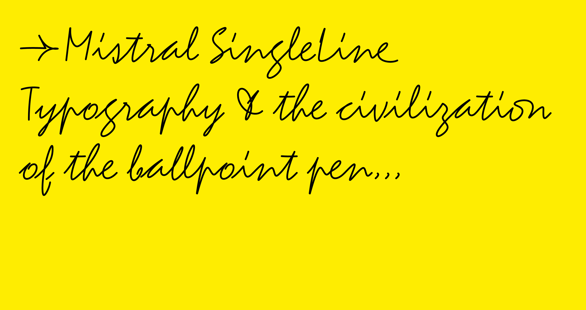

# Mistral SingleLine typeface

The “handwriting of the man of the twentieth century” with a ballpoint or a round fiber tip pen in hand... *Mistral SingleLine* is Roger Excoffon’s iconic script font in a monolinear version, distributed as both an open-paths skeletal font oriented towards CNC (Computer Numerical Control) practices and a classic outline font for print or web usages. *Mistral SingleLine* proposes a new digital interpretation of the Mistral metal typeface originally published in 1953 by the Olive Foundry (Marseille, France), providing never digitized landmark signs such as the interchangeable «paraphe» / “downstroke glyph” for ff, pp, ss combinations, the ligatures ll, on, qu, st, th and a, e, u finals with longer tails, etc. *Mistral SingleLine* offers an extended Latin character set with OpenType features (various stylistic sets, alternate signs, case sensitive punctuation and symbols, new ligatures, contextual alternates and old style figures by default) and an uppercase / lowercase revisited kerning. 

*Mistral SingleLine* provides a central-line path for a pen, laser, engraving or milling tool to follow for an efficient and clean looking typographical rendering in fab labs environments. Based on the OpenType-SVG format, *Mistral SingleLine* open)-paths font is running on Adobe apps (CC 2019 and above). *Mistral SingleLine* with its skeletal logic and parametric thickness can also be useful in print and web experiments. 

Following the release of [Relief SingleLine](https://github.com/isdat-type/Relief-SingleLine) in 2022, *Mistral SingleLine* is the second pedagogical experiment distributed by [isdaT-type](https://github.com/isdat-type), the collective micro-foundry of the graphic design department of the institut supérieur des arts et du design de Toulouse / [isdaT](https://www.isdat.fr/se-former/formation-initiale/dna/pedagogie-design-graphique/). 

*Mistral SingleLine* typeface is an open-source project available for download and use following the Open Font License ([OFL](https://scripts.sil.org/ofl)).

## Font formats

The Mistral SingleLine project is based on a main skeletal .glyphs + .ufo source and explores different font format exports: 

¶ Open Paths / CNC machining 

• `.OTF-SVG` for Adobe (CC ≥2019)

¶ Closed Outlines / Print and Web

• `OTF` 

• `WOFF2`

Other export formats will soon be available (.SVG for Inkscape + Hershey Text Extension, .TTF for CAD softwares like Rhinoceros 3D)

## How to use an OpenType-SVG open path font?

As this project is primarily focusing on graphic user interface solutions opened the largest possible audiences, *Mistral SingleLine* typeface is distributed as an OpenType-SVG color font format in order to simplify the layout process for the 2D fab lab community, i.e. having a single-line font editable in popular vector graphics and typographic composition softwares such as Illustrator or Indesign. *Mistral SingleLine* typeface, like [Relief SingleLine](https://github.com/isdat-type/Relief-SingleLine), is working seamlessly in Adobe apps (CC 2019 and above), opening new perspectives for makers worldwide. OpenType-SVG technology represents an interesting alternative to permit single-line fonts wider distribution and easier use. Fab lab users oriented towards 2D graphic practices can now easily access quality Bézier curves, kerning and OpenType features in their single-line typographical layouts!

Simply install the `MistralSingleLine-Regular_svg.otf` on your system (or directly in the / Fonts subfolder of Illustrator or Indesign), open Illustrator or Indesign, compose your paragraphs and titlings; when the layout is finished, duplicate it and just use the / Text / Vectorize function to obtain a single-line design to export as PDF or SVG file to engrave through your favorite CNC machine (pen plotters, laser cutting or milling machine).

When using *Mistral SingleLine* font with a laser-cutting machine, it is recommended to use the *cutting* function at low intensity and not the *engraving* function in order to reduce inscription’s tracing time on any surface (do preliminary laser power tests to determine the best speed-power couple for each material to engrave with an inscription).

*Mistral SingleLine* export as OpenType-SVG format was made possible thanks to [Frederik Berlaen](https://typemytype.com/)’s *SingleLine_otf-svgMaker* Python script for [Robofont](https://robofont.com/). This script permits to export any skeletal UFO-based font project towards a single-line / open paths OpenType-SVG font. *SingleLine_otf-svgMaker* uses [roundingPen](https://github.com/typemytype/outlinerRoboFontExtension/blob/master/Outliner.roboFontExt/lib/outlinePen.py) script by Frederik Berlaen. *SingleLine_otf-svgMaker* Python script is available on [SingleLine_otf-svgMaker](https://github.com/isdat-type/SingleLine_otf-svgMaker) separated isdaT-type’s Github repository.

## Contributors

[François Chastanet](http://francoischastanet.com/) Instagram [@francois_chastanet](https://www.instagram.com/francois_chastanet/), isdaT Graphic Design Department teacher in typography and type design, general design and project coordination.

[Élisa Garzelli](https://elisagarzelli.com/) (2020–22), Anaïs Alves & Morgane Autin (2022–23), isdaT Graphic Design Department students.

## Abstract

Mistral SingleLine → CNC machining, print and web → the iconic Roger Excoffon’s script font in a monolinear version → exports:  open-paths {.otf(-svg)} running on Adobe apps (CC2019 and above), print and web usages {closed outlines .otf, .woff2}, Drawbot {.ufo source} → Open Font License!

